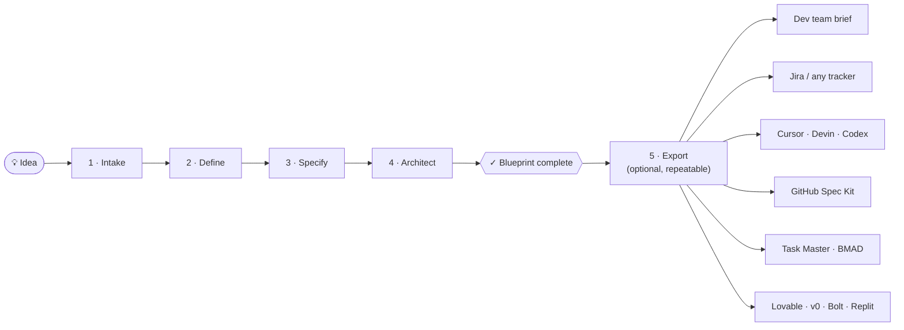

# Napkin to Blueprint (n2b)

> Turn a raw product idea into an investment-ready product blueprint — before you write any code.

[](https://www.npmjs.com/package/napkin-to-blueprint)
[](LICENSE)
[](#quickstart)

<!-- DEMO GIF: 90-second terminal recording (idea in → blueprint + exports out) goes here -->

**n2b** runs inside your AI coding agent — [Claude Code](https://claude.com/claude-code), [Codex](https://developers.openai.com/codex), [OpenCode](https://opencode.ai), or [Cursor](https://cursor.com). You describe the idea; a pipeline of specialized agents interviews you, researches the market, matures the idea into a complete product definition with implementation-ready feature specs, and pairs it with a recommended technical architecture. The result is a structured handoff package that any development team or AI coding tool can build from directly.

n2b **deliberately does not build the product.** The blueprint is the deliverable — the input *to* a build, not the build.

## Quickstart

Run in your project folder (an empty folder works — n2b creates everything it needs):

```bash
npx napkin-to-blueprint@latest
```

A picker asks which runtime(s) to install for. Or skip the picker with a flag:

```bash
npx napkin-to-blueprint@latest --claude      # Claude Code  → ./.claude/
npx napkin-to-blueprint@latest --codex       # Codex        → ./.codex/
npx napkin-to-blueprint@latest --opencode    # OpenCode     → ./.opencode/
npx napkin-to-blueprint@latest --cursor      # Cursor       → ./.cursor/
npx napkin-to-blueprint@latest --all         # all four
```

Flags combine (`--claude --cursor`). Installs are project-local: n2b's commands, agents, workflows, and templates land in the chosen runtime's directory inside your project, translated to that runtime's command format. Then open the folder in your runtime and start:

| Runtime | Installed to | Start here | Next stages |
|---------|--------------|------------|-------------|
| Claude Code | `./.claude/` | `/n2b:s1-init` | `/n2b:s2-define` … `/n2b:status` |
| Codex | `./.codex/` | `$n2b-s1-init` | `$n2b-s2-define` … `$n2b-status` |
| OpenCode | `./.opencode/` | `/n2b-s1-init` | `/n2b-s2-define` … `/n2b-status` |
| Cursor | `./.cursor/` | `/n2b-s1-init` (or mention `n2b-s1-init`) | `/n2b-s2-define` … `/n2b-status` |

From there, each stage tells you the exact next command when it finishes. To update n2b later, re-run the same `npx` command. Restart the runtime (or start a new session) after installing so it discovers the new commands.

> Commands in the rest of this README are written in Claude Code form (`/n2b:<name>`). On Codex use `$n2b-<name>`; on OpenCode and Cursor use `/n2b-<name>`.

## How it works

Five slash commands, run in order, inside your project:



Stages 1–3 mature the **product**: what it is, who it's for, and every feature specified in depth. Stage 4 rides on top of the finished features and answers **"how could this be built?"** — a recommended architecture plus documented alternatives, chosen on merit from the full landscape of modern cloud, SaaS, and API options. Stage 5 renders the finished blueprint for whichever tool or team will consume it.

## Why blueprint first?

Everyone with an idea now jumps straight into an AI build tool. It works — until it doesn't: AI gets you 70% of the way fast, and then the missing groundwork surfaces. No research, no feature definition, no data model, no acceptance criteria — the front half of the software development lifecycle got skipped, and the build drifts.

n2b fills exactly that gap:

- **Before you vibe code.** Run n2b first, then hand Lovable, v0, Bolt, or Cursor a blueprint instead of a vibe. Stage 5 even exports a per-feature prompt pack for your tool of choice. Vibe code the build — not the product decisions.
- **When you're one person with an idea.** No team, no PM, no architect? The pipeline plays those roles: interviewer, market researcher, spec writer, architect. One idea in → full feature list, per-feature specs, architecture, and database schema — before dev kickoff.
- **Before drift can start.** Spec tools that also *build* accumulate drift: specs and code slowly contradict each other mid-project. n2b ends at the handoff, so the blueprint you approve is the blueprint your builder receives.

## When to use n2b vs the others

n2b sits *upstream* of the popular spec-driven tools — it works with them, not against them:

| Tool | What it does | Use it when… |
|------|--------------|--------------|
| **n2b** | Idea → interview → research → specs → architecture → export | You have a raw idea and want a complete, tool-agnostic blueprint before any build starts |
| [GitHub Spec Kit](https://github.com/github/spec-kit) | Spec → plan → tasks → **implements** inside your coding agent | You already know what to build and want spec-guided implementation. *n2b exports Spec Kit format (`s5-export speckit`)* |
| [Task Master](https://github.com/eyaltoledano/claude-task-master) | Parses an **existing PRD** into tasks and subtasks | You already have a PRD. *n2b generates one for it (`s5-export prd`)* |
| [BMAD-Method](https://github.com/bmad-code-org/BMAD-METHOD) | Full agile lifecycle with role-play agents, planning through build | You want end-to-end inside one framework. *n2b's PRD export feeds its build phase* |
| [ChatPRD](https://www.chatprd.ai) | SaaS PRD writer for product managers | You want polished documents only, and SaaS is fine |

## Step-by-step walkthrough

### Stage 1 — Intake · `/n2b:s1-init`

**What you do:** have a conversation. n2b interviews you about your idea — vision, problem, target users, the experience you imagine, business context, scale expectations, integrations, constraints. It asks until it's confident, not until a form is filled; vague answers get follow-ups, and it tells you what it still doesn't understand. Already have notes or a brief? Paste them or point n2b at the file — it reads them first, only asks about what's missing, and keeps the original under `.n2b/inputs/source/` so nothing you wrote is lost.

**What you get:** `.n2b/BRIEF.md` — a validated, structured project brief — plus pipeline tracking in `.n2b/tracking/`.

**Your effort:** this is the stage where *you* do the talking. Everything after it is largely autonomous.

### Stage 2 — Define · `/n2b:s2-define`

**What you do:** run the command and let it work.

**What happens:** researcher, visionary, and synthesizer agents expand the brief into a full product definition — market research, user personas, user journeys, a prioritized feature list, scope boundaries, success metrics, and assumptions/constraints.

**What you get:** `.n2b/features/` — a seven-document product definition set, cross-checked by a completeness audit before the stage will pass.

### Stage 3 — Specify · `/n2b:s3-specify`

**What you do:** run the command — usually several times.

**What happens:** every feature is specified in implementation-ready depth: screens, automations, logic rules, integrations, and notifications, each with verbatim acceptance criteria. To fit provider limits, Stage 3 runs in **batches**: each invocation processes one pass (analysis → specification → review) for a handful of features, then stops at a clean checkpoint.

```
/n2b:s3-specify              # first run
/n2b:s3-specify --continue   # keep going after each checkpoint (repeat until done)
/n2b:s3-specify --batch 8    # optional: bigger batches
```

The final run reconciles every cross-reference and ID, then holds the output to a hard quality gate.

**What you get:** `.n2b/specifications/` — per-feature specs, a feature dependency map, and a platform-parameters registry.

### Stage 4 — Architect · `/n2b:s4-architect`

**What you do:** run the command; answer a short technical-profile questionnaire (deployment expectations, team skills, budget posture — "no preference" is a valid answer everywhere).

**What happens:** a technical researcher does live web research across the current technology landscape, then planner and architect agents produce a feasibility analysis, a **recommended architecture with documented alternatives and trade-offs** (stack, services, databases, APIs, hosting, auth — nothing artificially constrained), and a production-grade database schema.

**What you get:** `.n2b/architecture/` — five architecture documents. When the stage passes its gate, the pipeline reports **blueprint complete**: your `.n2b/` folder now *is* the handoff package.

### Stage 5 — Export (optional) · `/n2b:s5-export`

**What you do:** pick who the export is for. The command opens a two-level picker ("Who will use this export?" → variant), or you can name a target directly:

```
/n2b:s5-export                    # open the picker
/n2b:s5-export dev-brief          # or name a target
```

One format per invocation — run it as many times as you need. Every export is verified against the blueprint by a fidelity gate before it's accepted (counts reconciled, acceptance criteria carried verbatim).

**What you get:** `.n2b/exports/<target>/` — one of:

| Target | For | Contents |
|--------|-----|----------|
| `dev-brief` | A development team | Human-readable build brief, parts A–H + combined doc |
| `jira` | Jira | Epics + stories CSV (ACs verbatim) + import guide |
| `backlog` | Any tracker | Tool-neutral `backlog.json` + `backlog.csv` |
| `agent-workspace` | Coding agents (Devin, Cursor, Codex…) | Repo-shaped bundle: `AGENTS.md`, build order, operating rules |
| `speckit` | GitHub Spec Kit | `.specify/` constitution + per-feature spec folders |
| `prd` | Task Master / BMAD | `PRD.md` + `architecture.md` pair |
| `lovable-pack` `v0-pack` `bolt-pack` `replit-pack` | Vibe-coding tools | Distilled knowledge doc + one build prompt per feature + per-tool wrapper files |

All targets except `dev-brief` also embed a byte-identical copy of the full blueprint under `docs/blueprint/`.

### Anytime — `/n2b:status`

Reports pipeline state, per-stage progress, integrity checks, export freshness, and the exact next command to run. If you're ever unsure where you are, run this.

## Bring your own design system

n2b never generates a design system. If you have one, drop it into `.n2b/inputs/design-system/` (Markdown, design-token JSON, PDF, or a `SOURCES.md` of URLs) before Stage 3 — it's carried into the blueprint **verbatim** and the architecture maps to it as-is. If you don't, the package ships design-agnostic and the downstream builder owns visual design.

## What n2b is not

- It does not write application code, scaffold projects, or set up databases.
- It is not a replacement for a build tool — it produces the input *to* one.
- It is not a document generator you fill in — the pipeline interviews, researches, and holds its own output to quality gates before a stage will pass.

## Requirements

- One of: [Claude Code](https://claude.com/claude-code), [Codex](https://developers.openai.com/codex) (CLI ≥ 0.130.0 — earlier versions can list skills twice), [OpenCode](https://opencode.ai), or [Cursor](https://cursor.com)
- Node.js ≥ 16 (used only by the installer — zero npm dependencies)

On Codex, OpenCode, and Cursor the pipeline runs every agent on the host's configured default model; the `model_profile` setting only takes effect on Claude Code.

## Working on n2b itself

Source lives at this repository's root and is authored once, in Claude Code native format; the installer syncs it into the chosen runtime's directory (`.claude/`, `.codex/`, `.opencode/`, `.cursor/`), rewriting paths, command names, includes, and tool names for that host on the way. Runtime artifacts go to the target's `.n2b/`, never back into source.

| Path | Purpose |
|------|---------|
| `bin/install.js` | Installer — syncs source into a project's runtime directory, translating per runtime |
| `test/install.test.js` | Installer tests (`npm test`, zero dependencies) |
| `commands/n2b/` | Slash-command definitions |
| `n2b/agents/` | Stage subagent definitions |
| `n2b/workflows/` | Per-stage orchestration |
| `n2b/references/` | Methodologies, rules, and schemas |
| `n2b/templates/` | Output document + tracking templates |

```bash
node bin/install.js --claude --target /path/to/test/project   # install a local checkout (any runtime flag, or --all)
npm test                                                       # installer tests, incl. Claude Code byte-identity
```

Everything is Markdown — commands, workflows, agents, and templates are all `.md` files. After editing source, re-run the installer before testing. Claude Code output is a verbatim copy of source and is pinned by `test/fixtures/claude-baseline.json`; after an intentional source change, refresh it with `node test/install.test.js --update-baseline`.

See [CONTRIBUTING.md](CONTRIBUTING.md) for the full development loop and PR checklist, [CHANGELOG.md](CHANGELOG.md) for release notes, and [SECURITY.md](SECURITY.md) for how to report a vulnerability.

## License

MIT © [Tapas Mukherjee](https://github.com/tsmztech) — see [LICENSE](LICENSE).
